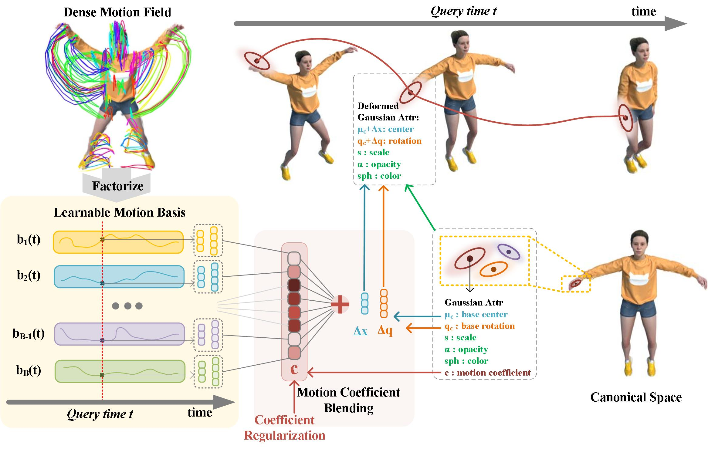

# DynMF: Neural Motion Factorization for Real-time Dynamic View Synthesis with 3D Gaussian Splatting
### [Project Page](https://agelosk.github.io/dynmf/) | [Paper](https://arxiv.org/abs/2003.08930004) 

[ DynMF: Neural Motion Factorization for Real-time Dynamic View Synthesis with 3D Gaussian Splatting](https://agelosk.github.io/dynmf/)  
 [Agelos Kratimenos](https://agelosk.github.io/)\,
 [Jiahui Lei](https://www.cis.upenn.edu/~leijh/)\,
 [Kostas Daniilidis](https://www.cis.upenn.edu/~kostas/)\
University of Pennsylvania

